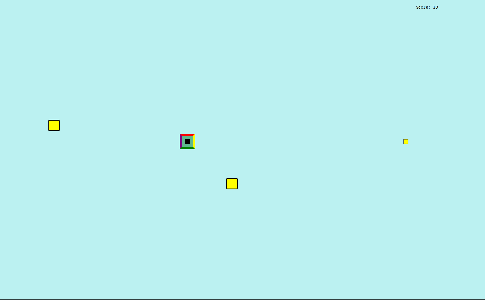

---
# Square Man
##### An astroid spin off that is rough around the edges

A browser based survive or die game with fast flying targets and even faster flying projectiles. Try your hardest to beat your best score and become one with the square

---
## Technology

This project only uses HTML CSS and vanilla javascript. Assests include a font, one image for the welcome page, and the image in the read me. No other libraries were used

---
## Try it out!

[Play Square Man Today!!!](https://telledelly.github.io/squareMan/index.html)
Use the mouse for movement and the wasd keys to shoot projectiles.
Make sure you hit the correct target with the correct projectile. All rules and controls can be found on the rule page. Brower based only. Mouse or trackpad required

---
## Future Work

Coming soon:
- Sound Effects
- Power ups
- Mobile Version
- Different Targets
- Different Levels

---
## Author

This repo was made by and is maintained by TelleDelly(Martin Wilson)
